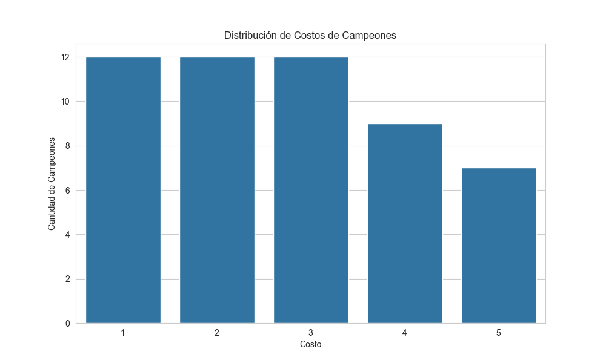
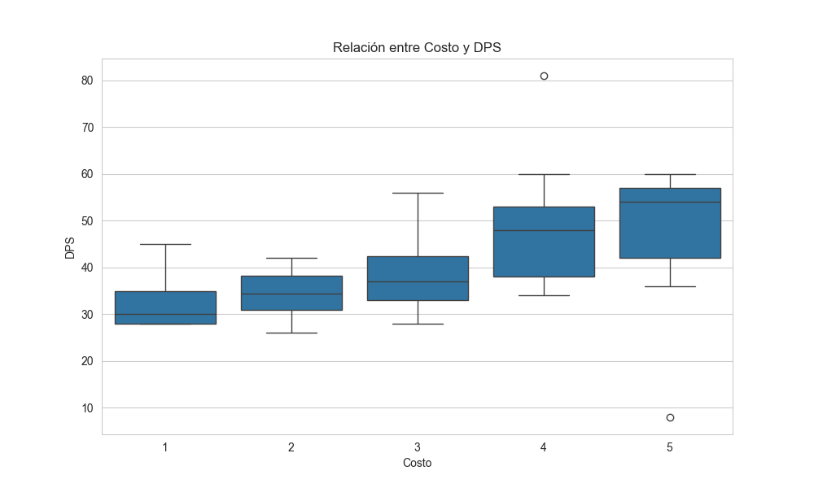
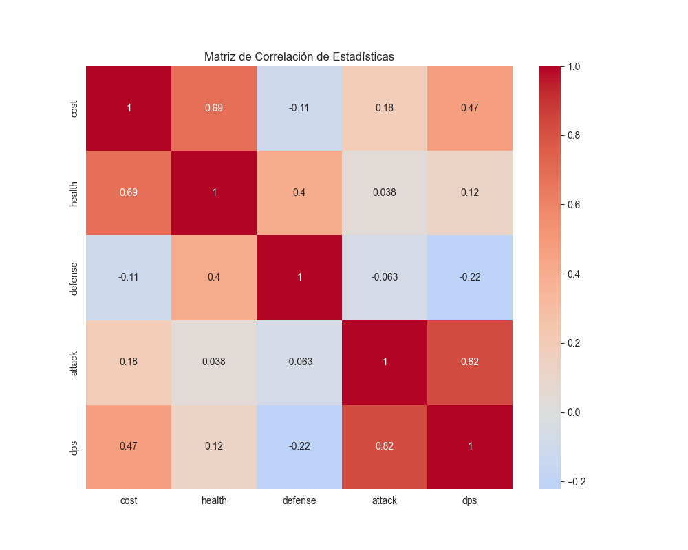

# special-octo-rotary-phone

A data analysis project focusing on TeamFight Tactics (TFT) champion and item statistics, featuring various visualizations and insights.

## Project Overview

This project analyzes TFT game data using Python, creating visualizations to understand relationships between different champion attributes and item statistics.

## Visualizations

The project includes three main visualizations:

1. **Cost Distribution** (cost_distribution.png)
   - Shows the distribution of champion costs in the game
   - Helps understand the economic balance of the game

2. **Cost vs DPS** (cost_vs_dps.png)
   - Visualizes the relationship between champion cost and their damage per second
   - Helps identify value propositions in champion selection


3. **Correlation Matrix** (correlation_matrix.png)
   - Displays correlations between various champion statistics
   - Useful for understanding relationships between different champion attributes


## Installation

1. Clone the repository:
   ```bash
   git clone https://github.com/yourusername/special-octo-rotary-phone.git
   cd special-octo-rotary-phone
   ```

2. Create and activate a virtual environment (recommended):
   ```bash
   python -m venv venv
   # On Windows
   venv\Scripts\activate
   # On Unix or MacOS
   source venv/bin/activate
   ```

3. Install required dependencies:
   ```bash
   pip install -r requirements.txt
   ```
## Usage

Run the analysis script:
```bash
python tft_analysis.py
```

This will generate the visualization PNG files in your project directory.

## Data Sources

The analysis uses two main data files:
- TFT_Champion_CurrentVersion.csv: Contains champion statistics
- TFT_Item_CurrentVersion.csv: Contains item information
